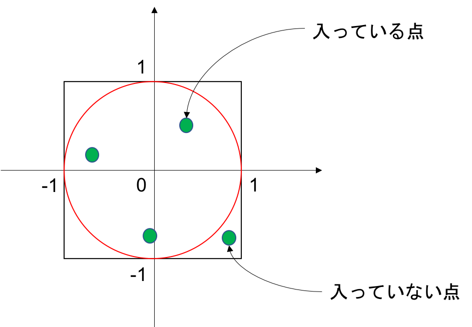

# Lesson 7 ~ 配列 ~

## Practice 4 ~ 発展問題：モンテカルロ法 ~
モンテカルロ法を用いて円周率π（= 3.141592...）の近似値を求めるプログラムを作成せよ．

以下はヒント，もといプログラムの設計である．

- -1 ~ 1の小数の乱数を2つ発生させ，それぞれx座標，y座標として１つの点とみなす
	- 例：0.3と0.75が得られた場合は点(0.3, 0.75)として解釈する
	- これは一辺の長さが2の正方形内に点を１つ置いていることになる
- 配置する点の数は10000個とし，2次元配列で管理する
- 配列名はpointsとし，サイズは10000×2とする．
	- i番目の点のx座標はpoints[i][0]
	- i番目の点のy座標はpoints[i][1]
- それぞれの点に対し，半径1の円の中に入っているかを判定し，入っている点をカウントしていく
- (入っている点の数)/10000 をすれば円の面積の近似値が得られる
- 半径1の円の面積はπなので，この値は円周率の近似値であるといえる

配置する点の数を増やせば増やすほど得られる近似値の精度は高くなる．
プログラムができたら100万個くらいで実行してみると面白いかもしれない．

#### モンテカルロ法とは？

## Practice 3
九九の結果を格納する9×9の2次元配列を作成せよ．
また，1 ~ 9の数字を2つ入力し，その掛け算の結果を，用意した配列を用いて表示せよ．
用意してあるコードに自分で追加して実装すること．

※余談だが，「hoge」や「piyo」はプログラミング界隈ではよく使われる言葉である．
嘘だと思うなら調べてみると良い．
hogeやpiyo自体に意味は無く，今回は「この部分に自分でコード書いてね」的な意味合いで使っている．

## Practice 2
次のプログラムを作成せよ．
- 5個の数値を入力する
- 入力された順番と逆の順に表示する

## Practice 1
次のプログラムを作成せよ．
- 5個の数値を入力する
- 入力された各々の数値を2倍して表示する
